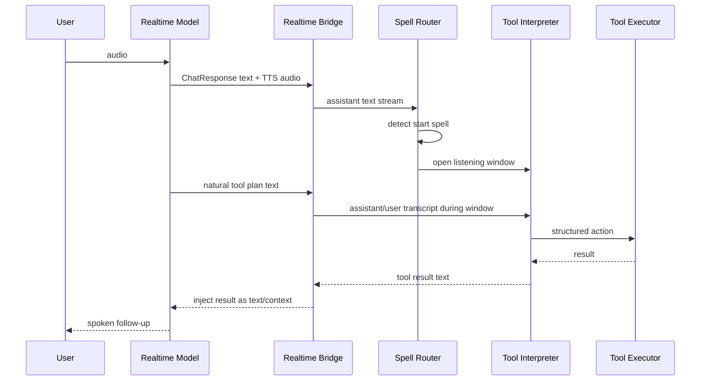

# ADR: 语音咒语工具协议作为候选方案

状态：candidate, depends-on backend-planner

日期：2026-05-17

## 背景

当前 demo 的主路线是：

`browser mic -> /api/realtime -> Volcengine realtime speech model -> browser audio`

我们已经删除本地 ASR -> LLM -> TTS 级联路线。工具调用也不应把系统重新拉回级联语音方案。

目标是在原生全双工语音体验中接入外部工具。难点是火山实时语音模型的 API 文档目前没有展示 OpenAI-style function calling 或通用 tool schema。如果只依赖模型口头表达，后端很难可靠知道何时启动工具监听。

## 决策

把“语音咒语工具协议”记录为交互层候选方案，但不作为底层工具调用主协议。底层主路线见 `2026-05-17-backend-planner-tool-calls.md`。

方案B的核心是让模型在自然对话中说出低碰撞触发短语，后端根据 assistant text 事件匹配触发窗口。触发后，由工具侧 LLM 监听窗口内的自然语言，把意图和参数结构化，再交给 ToolExecutor 执行。工具结果再作为文本反馈注入实时会话，让语音模型继续口语化回应。

## 设计草图

## 约束

- 触发短语必须低碰撞，且不应像普通业务文本。
- 工具执行必须有幂等键，避免模型重复说触发词导致重复动作。
- 高风险工具必须二次确认；地图、导航、展示类工具可先自动执行。
- 模型不能在工具结果回来前声称“已经完成”；提示词中应要求它使用“我来处理一下”等中间话术。
- 后端必须记录触发窗口、解析输入、工具调用、工具结果，方便调试。

## 与方案A的关系

方案A中的官方 `web_agent` 只能作为参考材料，不能调用我们的服务。官方 `external_rag` 是结果注入通道。真正工具调用主路线是后端 Planner；咒语方案如果实现，也应建立在后端 Planner 之上。

## 后续验证

- 用 assistant text 流做触发词匹配，验证延迟和稳定性。
- 用一个只打开地图的无参数工具做端到端 tracer bullet。
- 比较方案A的外部 RAG / 联网 Agent 能否替代工具监听窗口。
